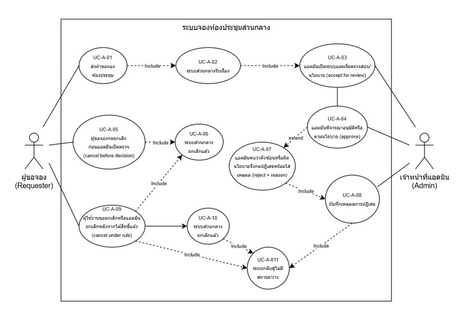
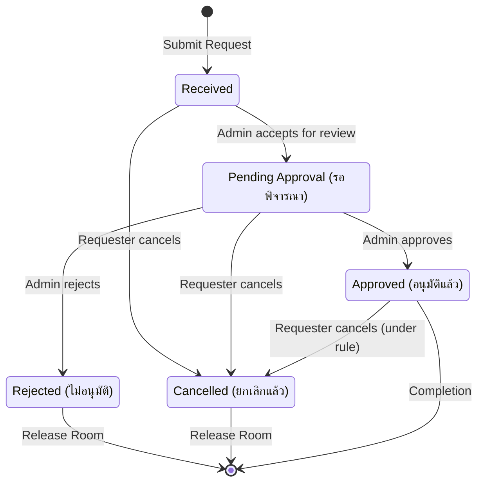

# 1. Evidence Readiness Check (ตรวจสอบความพร้อมหลักฐาน)
- **EV-01 (High Confidence - Fact):** คุณเอเปิดดูตารางจองจากไฟล์ Excel ใน Shared Drive ตอน 08:00 น. พบช่องว่างช่วง 09:00-11:00 น. จึงพิมพ์ชื่อทีมแล้วกด Save
- **EV-02 (High Confidence - Fact):** คุณเอส่ง LINE บอกแอดมินว่า "พี่จองห้อง A นะ" โดยไม่ได้รอการตอบกลับยืนยัน
- **EV-03 (High Confidence - Fact):** เวลา 09:00 น. ทีม Sales พาลูกค้ามาถึงหน้าห้องและพบทีม Project Kickoff นั่งใช้งานอยู่ก่อนแล้ว
- **EV-04 (High Confidence - Fact):** ทีม Project Kickoff มี Email ยืนยันการอนุมัติจองห้องจากแอดมินตั้งแต่เย็นวันก่อนหน้า
- **EV-05 (High Confidence - Fact):** แอดมินรับเรื่องจากหลายช่องทาง (LINE, Email) และต้องมาอัปเดตไฟล์ Excel เองแบบแมนนวล จึงไม่ได้ทำแบบ Real-time

---

# 2. Raw Requirement List (รายการความต้องการดิบก่อนจัดประเภท)
1. ระบบต้องแสดงตารางจองห้องประชุมส่วนกลางให้ทุกคนเห็น
2. ระบบต้องป้องกันไม่ให้คนจองเวลาชนกัน
3. ระบบต้องยอมรับข้อมูลการจองเมื่อพิมพ์ชื่อลงไป
4. แอดมินต้องสามารถอนุมัติการจองผ่าน Email ได้
5. ระบบต้องอัปเดตข้อมูลอัตโนมัติไม่ใช้แมนนวล
6. ระบบต้องมีการส่ง LINE แจ้งเตือนเมื่อจองเสร็จ
7. ระบบต้องบันทึกว่าใครเป็นคนเปลี่ยนข้อมูลและเปลี่ยนเวลาไหน

---

# 3. Phase: Requirement Quality + Clean Backlog
จากกระบวนการ Quality Clinic ทีมงานได้รวมข้อซ้ำ แยกข้อที่ไม่เป็น Atomic ตัด Design Bias (เช่น การเจาะจงใช้ LINE หรือ Email) และคัดกรองระบบที่อยู่นอกขอบเขตออก จนได้รายการความต้องการที่เคลียร์และพร้อมใช้งานดังนี้: 

- **[Clean-REQ-01]:** ระบบต้องแสดงตารางสถานะคำขอจองห้องประชุมผ่านฐานข้อมูลส่วนกลางชุดเดียวกันแบบ Real-time (แก้ปัญหา Data Out of Sync) 
- **[Clean-REQ-02]:** ระบบต้องตรวจสอบและล็อกการส่งคำขอจองโดยอัตโนมัติ หากช่วงเวลาและห้องประชุมนั้นมีสถานะถูกจองอยู่ก่อนแล้ว (แก้ปัญหา Double-booked) 
- **[Clean-REQ-03]:** ระบบต้องรองรับการส่งคำขอจองโดยบันทึกข้อมูลขั้นต่ำที่จำเป็น (ชื่อผู้จอง, ทีม, วัตถุประสงค์, วันเวลา และห้อง) 
- **[Clean-REQ-04]:** ระบบต้องมีฟังก์ชันให้เจ้าหน้าที่แอดมินตรวจสอบคำขอและกดยืนยัน (Approve) หรือปฏิเสธ (Reject) พร้อมระบุเหตุผลได้ 
- **[Clean-REQ-05]:** ระบบต้องบันทึกประวัติการเปลี่ยนสถานะ คำสั่ง วันเวลา และรหัสผู้กระทำการ (Audit Trail) ทุกครั้งที่มีการเปลี่ยนแปลง 
- **[Clean-REQ-06]:** คำขอจองห้องประชุมจะถือว่าได้รับสิทธิ์ใช้งานอย่างเป็นทางการต่อเมื่อสถานะเปลี่ยนเป็น "Approved" เท่านั้น (กำหนดเป็น Business Rule เพื่อปรับนิยามให้ตรงกัน) 

### Candidate Requirements — ตัวอย่างก่อน Clean (Team A)
| CR | Candidate | Evidence | Day 3 action |
|---|---|---|---|
| CR-A-01 | ตารางปฏิทินแสดงคิวการจองห้องประชุมส่วนกลางทั้งหมด | EV-01, EV-05 | clean and classify (ตัดคำว่า Excel/Shared Drive ออกและจัดกลุ่มประเภท) |
| CR-A-02 | ผู้ใช้งานสามารถพิมพ์ชื่อทีมเพื่อบันทึกจองและทักข้อความบอกแอดมิน | EV-01, EV-02 | remove design bias / identify conflict (ตัด LINE ออก และแก้ความเข้าใจผิดเชิงนิยาม) |
| CR-A-03 | ระบบล็อกและสกัดอัตโนมัติเมื่อมีการจองห้องในช่วงเวลาที่คาบเกี่ยวซ้อนทับกัน | EV-03, EV-04 | verify and specify (นำไปเขียนขยายความในขอบเขตและเงื่อนไขการล็อก) |
| CR-A-04 | แอดมินตรวจสอบคิวและกดอนุมัติการจองผ่าน Email ตอบกลับ | EV-04, EV-05 | remove design bias (ตัดช่องทางแมนนวล Email ออก ให้ใช้ฟังก์ชันอนุมัติบนระบบกลาง) |
| CR-A-05 | แสดงสถานะคำขอ (Received/Pending/Approved/Rejected) ของแต่ละคิวจองแยกกันชัดเจน | EV-02, EV-04, EV-05 | define states (นำไปกำหนดเป็นสถานะและวงจรชีวิตในระบบปฏิทินส่วนกลาง) |
| CR-A-06 | ห้ามพาลูกค้าเข้าใช้ห้องประชุมเด็ดขาด หากสถานะคำขอจองยังไม่เปลี่ยนเป็น Approved | EV-02, EV-03, EV-04 | resolve business rule (สกัดเป็นกฎทางธุรกิจที่ระบบและพนักงานต้องเคารพร่วมกัน) |
| CR-A-07 | บันทึกประวัติว่าแอดมินหรือใครเป็นคนกดยืนยันคำขอในเวลาใด | EV-04, EV-05 | clean and classify (ระบุเป็น Non-functional ด้าน Audit Trail เพื่อใช้ย้อนตรวจสิทธิ์) |

---

# P05 — Prioritized Requirements Backlog

| ID | Requirement | Type | Priority | Evidence Ref. | Rationale (เหตุผลการจัดลำดับ) |
|---|---|---|---|---|---|
| FR-A-01 | แสดงสถานะคำขอด้วยชุดสถานะกลางผ่านระบบส่วนกลางแบบ Real-time | Functional | Must | EV-01, EV-05 | จำเป็นต่อการทำให้ข้อมูลตรงกัน (Single Source of Truth) |
| FR-A-02 | ตรวจความขัดแย้งของทรัพยากรและเวลา เพื่อล็อกการจองซ้ำซ้อนอัตโนมัติ | Functional | Must | EV-03, EV-04 | เป็นหัวใจหลักในการแก้ปัญหาการจองชนกันหน้าห้อง |
| FR-A-03 | ส่งคำขอพร้อมข้อมูลขั้นต่ำของแผนงานและเวลา | Functional | Must | EV-01 | เป็นจุดเริ่มต้น (Trigger) ในการสร้างข้อมูลเข้าสู่ระบบ |
| FR-A-04 | ผู้มีสิทธิ์ (แอดมิน) สามารถอนุมัติ/ปฏิเสธพร้อมระบุเหตุผลผ่านระบบได้ | Functional | Must | EV-04, EV-05 | เพื่อยืนยันสิทธิ์และเปลี่ยนการทำงานแมนนวลให้เป็นระบบ |
| BR-A-01 | การได้สิทธิ์เข้าใช้ห้องประชุมต้องเกิดจากสถานะ "Approved" เท่านั้น | Business Rule | Must | EV-02, EV-04 | เพื่อล้างความเข้าใจผิดเชิงนิยามของผู้ใช้งาน |
| NFR-A-01 | บันทึก Audit Trail การเปลี่ยนสถานะ (ผู้กระทำ วันเวลา สถานะเดิมและใหม่) | NFR | Must | EV-05 | ใช้ตรวจสอบย้อนหลังเมื่อเกิดการร้องเรียนเรื่องคิว |
| FR-A-05 | ดูประวัติการเปลี่ยนสถานะของคำขอจอง | Functional | Should | EV-05 | สำคัญแต่เลื่อนได้ในเวอร์ชั่นแรก |
| - | ระบบส่งการแจ้งเตือนผ่านช่องทางแอปพลิเคชัน LINE | Functional | Won't | EV-02 | ถูกปัดตกเนื่องจากติดข้อจำกัดห้ามเชื่อมต่อภายนอก |

### Must Capability Groups
| Group | Requirement | เหตุผล |
|---|---|---|
| M1 | FR-A-01 | Event Aggregate กลาง (แสดงผลคิวจองและสถานะทั้งหมดจากระบบฐานข้อมูลกลางชุดเดียวกัน) |
| M2 | FR-A-02 | Availability โปร่งใส (ตรวจสอบช่วงเวลาชนกันและล็อกการจองซ้ำซ้อนโดยอัตโนมัติ) |
| M3 | FR-A-03 + FR-A-04 | Routing และ Responsibility (กระบวนการส่งคำขอจองพร้อมข้อมูลขั้นต่ำและการส่งต่อให้แอดมินอนุมัติ/ปฏิเสธผ่านระบบ) |
| M4 | BR-A-01 | แยก Item Status/Overall Readiness (กำหนดให้ชัดเจนว่าสิทธิ์การเข้าใช้ห้องต้องมาจากสถานะ Approved เท่านั้น ไม่ใช่แค่การกรอกคำขอ) |
| M5 | FR-A-01 (Notification Target) | Action Required Notification (การปรับปรุงให้ระบบสะท้อนสถานะล่าสุดเพื่อให้ผู้ใช้ทุกฝั่งรับทราบพฤติกรรมระบบที่เปลี่ยนไป) |
| M6 | NFR-A-01 | Decision/Revision Audit (การบันทึก Audit Trail เพื่อเก็บประวัติการเปลี่ยนสถานะ คำสั่ง วันเวลา และผู้กระทำการ) |

*Constraint Check: Must Functional Capability Groups = 6/6*

---

# P06 — User Stories, Use Cases and Acceptance Criteria

## 1. User Stories
| ID | User Story | Coverage |
|---|---|---|
| US-A-01 | ในฐานะ ผู้ขอจอง (Requester) ฉันต้องการส่งคำขอจองห้องประชุมผ่านปฏิทินระบบกลางโดยกรอกข้อมูลขั้นต่ำครั้งเดียว เพื่อบันทึกเวลาคิวของกิจกรรมในระบบส่วนกลาง | FR-A-01, FR-A-03; AC-A-01..03 |
| US-A-02 | ในฐานะ ผู้ขอจอง (Requester) ฉันต้องการเห็นชุดสถานะตรงกลางที่ชัดเจน เพื่อทราบผลการตรวจสอบคิวและสิทธิ์การเข้าใช้ห้องที่แน่นอน ป้องกันการพาลูกค้ามาชนกันหน้าห้อง | FR-A-01, FR-A-04; BR-A-01; AC-A-03/05/06 |
| US-A-03 | ในฐานะ เจ้าหน้าที่แอดมิน (Admin) ฉันต้องการตรวจสอบคิวและตัดสินใจเปลี่ยนสถานะคำขอเฉพาะภายในระบบกลางชุดเดียว เพื่อไม่ให้เกิดช่องว่างจากการทำงานแบบแมนนวล | FR-A-04; BR-A-01; NFR-A-01 |
| US-A-04 | ในฐานะ ผู้ขอจอง (Requester) ฉันต้องการกดยกเลิกสิทธิ์คำขอจองของตนเองได้เมื่อแผนงานเปลี่ยน เพื่อปล่อยห้องว่างคืนสู่ระบบโดยไม่ต้องรอให้แอดมินลบข้อมูล | FR-A-05; AC-A-07/08 |

## 2. Use Cases

### แผนภาพ Use Case Diagram (ระบบจองห้องประชุมส่วนกลาง)

### UC-A-01 — Submit Room Booking Request
- **Primary Actor:** ผู้ขอจองกิจกรรม (Requester) 
- **Main Flow:**
  1. ผู้ขอจองเลือกห้องประชุม BOARD ROOM A วันและเวลาที่ต้องการบนตารางปฏิทินระบบกลาง 
  2. กรอกข้อมูลกิจกรรมร่วมหนึ่งครั้ง (ชื่อผู้จอง, แผนก/ทีม, วัตถุประสงค์) 
  3. ระบบตรวจสอบความว่าง (Availability) และแสดงเวลา Last-checked บนระบบส่วนกลาง 
  4. ผู้ขอจองกดส่งคำขอ (Submit) เข้าสู่ระบบ 
  5. ระบบลงบันทึกเวลาคำขอ (Timestamp) พร้อมปรับสถานะเป็น Received (รับเรื่องแล้ว) อัตโนมัติ 
  6. ระบบล็อกช่วงเวลานั้นบนตารางกลาง เพื่อจัดคิวรอเข้าสู่ขั้นตอนการพิจารณา 
- **Alternate Flow:**
  1. ห้องมีคิวรอพิจารณาอยู่ก่อนหน้า: ระบบยอมให้ยื่นคำขอได้ แต่จะแสดงคำเตือน (Warning) ให้ผู้ใช้ทราบว่ามีคิวก่อนหน้าอยู่ และปรับสถานะเป็นคิวสำรอง
- **Exception Flow:**
  1. ช่วงเวลาซ้อนทับกับห้องประชุมที่มีสถานะ Approved: ระบบจะล็อกไม่ให้กดปุ่มส่งคำขอจองซ้ำ และแสดงข้อความเตือนความขัดแย้งของเวลา (Double-booked) โดยไม่บันทึกธุรกรรมลงระบบ 

### UC-A-02 — Review and Decide Booking Request
- **Primary Actor:** เจ้าหน้าที่แอดมิน (Admin) 
- **Main Flow:**
  1. แอดมินเปิดระบบกลางเพื่อดูรายการคำขอจองห้องประชุมที่ค้างอยู่ในความรับผิดชอบ 
  2. ระบบแสดงผลเรียงตามลำดับเวลา Timestamp ที่ยื่นคำขอเข้ามา 
  3. แอดมินตรวจสอบรายละเอียด ความถูกต้อง และนโยบายความสำคัญ 
  4. แอดมินเลือกเปลี่ยนสถานะเป็น Approved (อนุมัติแล้ว) หรือ Rejected (ไม่อนุมัติ) 
  5. หากเลือก Rejected แอดมินต้องใส่เหตุผลประกอบ 
  6. ระบบเปลี่ยนผ่านสถานะ ปลดล็อกห้อง (ในกรณีไม่ผ่าน) และส่งการปรับปรุงขึ้นหน้าจอส่วนกลาง 
- **Exception Flow:**
  1. ผู้ใช้ที่ไม่มีสิทธิ์พยายามเปลี่ยนสถานะ: ระบบจะบล็อกการทำงานและปฏิเสธคำสั่ง (Unauthorized Action) พร้อมแสดงข้อความเตือน 

### UC-A-03 — Cancel Booking Request
- **Primary Actor:** ผู้ขอจองกิจกรรม (Requester) 
- **Main Flow:**
  1. ผู้ขอจองเปิดดูรายการคำขอจองที่เป็นเจ้าของ 
  2. เลือกคำขอที่ต้องการยกเลิกและกดปุ่ม Cancel 
  3. ระบบบังคับให้กดยืนยัน (Explicit Organizer Confirmation) ก่อนการเปลี่ยนแปลง 
  4. ระบบปรับเปลี่ยนสถานะของรายการจองนั้นเป็น Cancelled (ยกเลิกแล้ว) 
  5. ระบบปลดล็อกช่วงเวลาดังกล่าวบนตารางปฏิทินส่วนกลางเพื่อคืนสิทธิ์ห้องว่างให้ผู้อื่นทันที 
- **Exception Flow:**
  1. ยกเลิกรายการที่ไม่ใช่ของตนเอง: ระบบไม่อนุญาตให้เข้าถึงปุ่มสั่งการ

## 3. Acceptance Criteria
| ID | Acceptance Criterion Summary | Coverage |
|---|---|---|
| AC-A-01 | ผู้ขอจองกรอกข้อมูลกิจกรรมครั้งเดียว และข้อมูลถูกนำไปใช้อ้างอิงในตารางคำขอจองส่วนกลางระบบเดียวกัน | FR-A-03 |
| AC-A-02 | เมื่อกด Submit ระบบต้องผูกเวลา Timestamp (ระดับวินาที) เข้ากับคำขอจองทันทีเพื่อสร้างความโปร่งใสเรื่องลำดับคิว | FR-A-03, NFR-A-01 |
| AC-A-03 | หน้ารายการสถานะต้องดึงข้อมูลจากแหล่งเดียวกันแบบ Real-time และต้องแสดงคำว่า "Received" หรือ "Pending Approval" สำหรับคิวที่รอยืนยัน ห้ามใช้ข้อความที่สื่อสารถึงความพร้อมสิทธิ์เสมือน Approved | FR-A-01 |
| AC-A-04 | เจ้าหน้าที่แอดมินต้องดำเนินการเปลี่ยนสถานะอนุมัติ/ปฏิเสธผ่านหน้าต่างระบบกลางเท่านั้น ห้ามใช้ช่องทางนอกระบบ | FR-A-04 |
| AC-A-05 | หากคำขอจองมีสถานะเป็น Received หรือ Pending Approval ผู้ขอจองจะยังไม่มีสิทธิ์เข้าใช้ห้องจนกว่าจะผ่านเกณฑ์อนุมัติ (สอดคล้องกับ Business Rule) | BR-A-01 |
| AC-A-06 | หากผู้ขอจองพยายามเลือกจองในเวลาที่ทับซ้อนกับรายการที่ได้รับการ Approved แล้ว ระบบต้องปิดกั้นปุ่มกดส่งคำขอ (ล็อกไม่ให้ส่งคำขอซ้ำได้) | FR-A-02 |
| AC-A-07 | ระบบจะไม่เปลี่ยนสิทธิ์หรือสถานะของห้องประชุมจนกว่าจะได้รับการตรวจสอบและกดยืนยันอย่างชัดเจนจากตัวบุคคล (Explicit Confirmation) | FR-A-04, FR-A-05 |
| AC-A-08 | ทุกธุรกรรมการเปลี่ยนผ่านสถานะ (Received , Pending , Approved/Rejected/Cancelled) ระบบต้องบันทึกประวัติรหัสผู้กระทำ, วันเวลาอย่างแม่นยำ (Audit Trail) | NFR-A-01 |
| AC-A-09 | ระบบต้องแสดงการอัปเดตสถานะล่าสุดสะท้อนให้ผู้ใช้งานทุกคนเห็นบนตารางปฏิทินส่วนกลางภายในกรอบ 2 วินาที (Target-to-Validate) | FR-A-01 |
| AC-A-10 | สิทธิ์การเข้าถึงเมนูอนุมัติคิวจองและปุ่มจัดการระบบ ต้องจำกัดเฉพาะผู้ใช้ที่มี Role เป็นแอดมินที่กำหนดไว้เท่านั้น | FR-A-04 |

---

# P07 — Booking Status Model 

### ตารางสถานะการจอง (State Transition Table)
| สถานะเริ่มต้น (Current State) | เหตุการณ์ / เงื่อนไข (Trigger / Transition) | สถานะใหม่ (Next State) | รหัสอ้างอิง |
|---|---|---|---|
| ไม่มีสถานะ / ว่าง | ผู้ขอจองส่งคำขอผ่านระบบกลาง (submit) | Received (รับเรื่องแล้ว) | FR-A-01, FR-A-03 |
| Received (รับเรื่องแล้ว) | แอดมินเปิดระบบและเริ่มตรวจสอบคิว/นโยบาย (accept for review) | Pending Approval (รอพิจารณา) | FR-A-01, FR-A-04 |
| Received (รับเรื่องแล้ว) | ผู้ขอจองกดยกเลิกเองก่อนแอดมินเปิดตรวจ (cancel before decision) | Cancelled (ยกเลิกแล้ว) | FR-A-01, FR-A-05 |
| Pending Approval (รอพิจารณา) | ผู้ขอจองกดยกเลิกคำขอระหว่างรอตรวจสอบ (cancel before decision) | Cancelled (ยกเลิกแล้ว) | FR-A-05 |
| Pending Approval (รอพิจารณา) | แอดมินตรวจสอบแล้วคิวว่างและตรงตามนโยบาย (approve) | Approved (อนุมัติแล้ว / จองสำเร็จ) | FR-A-01, FR-A-04, BR-A-01 |
| Pending Approval (รอพิจารณา) | แอดมินพบว่าคิวซ้อนหรือผิดนโยบายจึงกดปฏิเสธพร้อมใส่เหตุผล (reject + reason) | Rejected (ไม่อนุมัติ) | FR-A-01, FR-A-04 |
| Approved (อนุมัติแล้ว) | ผู้ใช้งานขอยกเลิกหรือเคลียร์ห้องหลังจากได้สิทธิ์แล้ว (cancel under rule) | Cancelled (ยกเลิกแล้ว) | FR-A-05 |
| Cancelled / Rejected | ระบบปลดล็อกและคืนสิทธิ์ห้องประชุมเข้าสู่ระบบส่วนกลางอัตโนมัติ | ไม่มีสถานะ / ว่าง | FR-A-01, FR-A-02 |

### แบบจำลองวงจรชีวิตและสถานะการจอง (Booking Status Flow)

---

# ช่องโหว่เชิงระบบ (System Gaps):
- **คำขอค้างในระบบ:** ยังไม่มีเงื่อนไขตัดสิทธิ์คำขอที่ค้างอยู่ในสถานะ Pending Approval จนเลยเวลาใช้งานจริง ซึ่งทำให้บล็อกคิวผู้อื่นโดยไม่จำเป็น 
- **การจัดการคิวสำรอง:** ยังไม่มีข้อกำหนดว่าถ้ารายการแรกถูก Rejected หรือ Cancelled ระบบจะขยับคิวถัดไปขึ้นมาพิจารณาโดยอัตโนมัติอย่างไร

# ประเด็นนโยบายที่ต้องเคลียร์ (Open Issues):
- **OI-A-01:** ผู้ใช้กดยกเลิกสิทธิ์ (Cancelled) ได้ช้าสุดกี่ชั่วโมงก่อนเริ่มประชุม มีเวลาตัดรอบ (Cutoff Time) หรือไม่ 
- **OI-A-02:** หากโดน Rejected ผู้ใช้สามารถแก้ไขเวลาบนรายการเดิมเพื่อส่งตรวจใหม่ได้เลย หรือต้องสร้างคำขอใหม่ทั้งหมด 
- **OI-A-03:** กฎเกณฑ์กลางในการตัดสินคิวของแอดมินคืออะไร (เช่น กิจกรรมพบลูกค้าภายนอกได้สิทธิ์ก่อนประชุมภายใน) เพื่อลดการใช้ดุลยพินิจส่วนตัว
