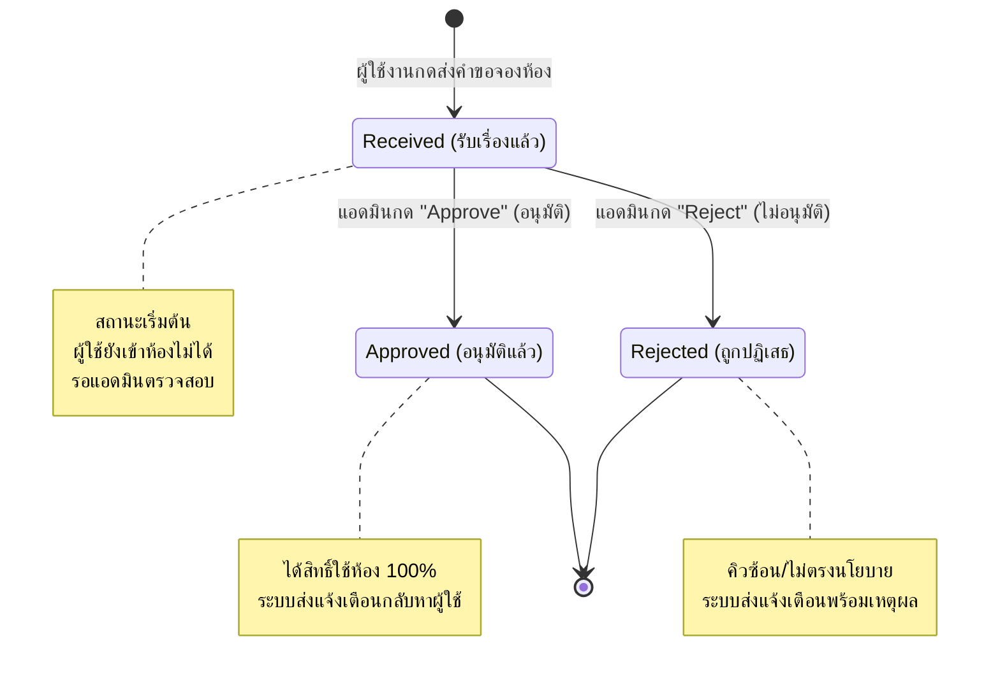

# P05 — Prioritized Requirements Backlog

## 1. Must Have (ต้องมี - หากไม่มีระบบจะทำงานไม่ได้หรือแก้ปัญหาไม่ได้)
- **[REQ-01] Centralized Single Source of Truth:** ระบบต้องมีฐานข้อมูลกลางระบบเดียวในการบันทึกและแสดงสถานะการจองห้องประชุมแบบ Real-time เพื่อป้องกันข้อมูลไม่อัปเดต (Data Out of Sync) และตัดปัญหาช่องทางกระจายตัว (อ้างอิงจาก: ISS-01, ISS-02)
- **[REQ-02] Double-Booking Prevention:** ระบบต้องล็อกไม่ให้มีการกดส่งคำขอจองหรือกรอกข้อมูลในวัน/เวลาที่ห้องนั้นถูกจับจองไปก่อนแล้ว (มีสถานะเป็น Approved หรือ Pending) เพื่อป้องกันการจองชนกันอย่างเด็ดขาด (อ้างอิงจาก: ISS-02, EV-03, EV-04)
- **[REQ-03] Unified Booking Status Model:** ระบบต้องแสดงสถานะการจอง (Booking Status) ที่เป็นมาตรฐานเดียวกันให้ทุกกลุ่มผู้ใช้งานเห็นตรงกัน (อ้างอิงจาก: ISS-03)

## 2. Should Have (ควรมี - สำคัญมากและส่งผลต่อความพึงพอใจและลดภาระงาน)
- **[REQ-04] Automated Notification System:** ระบบควรส่งการแจ้งเตือน (Notification) ไปยังผู้ขอจองโดยอัตโนมัติเมื่อแอดมินเปลี่ยนสถานะการจอง (เช่น จาก Received -> Approved หรือ Rejected) เพื่อสร้างความชัดเจนในนิยามคำว่า "จองสำเร็จ" (อ้างอิงจาก: ISS-03, EV-02)
- **[REQ-05] Admin Dashboard / Approval Interface:** ระบบควรมีหน้าต่างสำหรับแอดมินตรวจสอบคำขอที่เข้ามาเรียงตามลำดับเวลา (Timestamp) เพื่ออนุมัติหรือปฏิเสธได้ง่าย ไม่ต้องทำแบบแมนนวลบน Excel (อ้างอิงจาก: EV-05)

## 3. Could Have (มีก็ดี - เพิ่มความสะดวกสบายแต่ไม่มีระบบก็ยังทำงานได้)
- **[REQ-06] Calendar Integration:** ระบบสามารถเชื่อมต่อข้อมูลปฏิทินส่วนตัวของผู้ใช้งาน (เช่น Google Calendar หรือ Outlook) เพื่อให้ผู้ใช้สามารถกดจองหรือดูคิวผ่านหน้าปฏิทินของตนเองได้เลย (อ้างอิงจาก: ขั้นตอนเริ่มต้นของ Requester)

## 4. Won't Have (ยังไม่มีในเฟสนี้ - พักไว้ก่อนเพื่อโฟกัส Core Problem)
- **[REQ-07] Room Analytics & Insight:** ระบบการวิเคราะห์สถิติความหนาแน่นและอัตราการใช้ห้องประชุมในแต่ละแผนกเพื่อการบริหารทรัพยากรระยะยาว

---

# P06 — User Stories / Acceptance Criteria

## User Story 1: สำหรับผู้ขอจอง (Requester - ฝั่งทีม Sales หรือ Project)
- **User Story:**
ในฐานะ **ผู้ขอจอง (Requester)** ฉันต้องการ **เห็นสถานะการจองห้องประชุมที่อัปเดตแบบ Real-time และชัดเจน** เพื่อที่ฉัน **จะได้ไม่เข้าใจผิดว่าการจองเสร็จสิ้นแล้ว ทั้งที่ยังไม่ได้สิทธิ์ และป้องกันการพาลูกค้ามาชนกันหน้าห้อง**
- **Acceptance Criteria (เงื่อนไขการยอมรับ):**
  - **Scenario 1:** เมื่อเปิดหน้าตารางห้องประชุม ระบบต้องแสดงแถบสีและชื่อสถานะที่ตรงกันสำหรับผู้ใช้ทุกคน (ห้ามใช้ไฟล์ Excel แมนนวลแยกกัน)
  - **Scenario 2:** เมื่อกดจองห้องสำเร็จในขั้นต้น ระบบต้องขึ้นสถานะว่า "Received (รับเรื่องแล้ว)" พร้อมข้อความเตือนชัดเจนว่า "สถานะนี้ยังไม่สามารถเข้าใช้ห้องได้ กรุณารอแอดมินตรวจสอบ" เพื่อแก้ปัญหานิยามที่ไม่ตรงกัน
  - **Scenario 3:** เมื่อแอดมินกดอนุมัติ ระบบต้องเปลี่ยนสถานะเป็น "Approved (อนุมัติแล้ว)" และส่ง Notification แจ้งเตือนผู้จองทันที

## User Story 2: สำหรับเจ้าหน้าที่แอดมิน (Admin / Staff)
- **User Story:**
ในฐานะ **เจ้าหน้าที่แอดมิน (Admin)** ฉันต้องการ **ระบบจัดการคำขอจองห้องจากศูนย์กลางที่เรียงลำดับเวลาก่อน-หลังได้ชัดเจน** เพื่อที่ฉัน **จะได้ไม่ต้องคอยเปิดอ่าน LINE หรือ Email สลับไปมาเพื่อมาพิมพ์ลง Excel ด้วยตัวเอง ซึ่งทำให้ข้อมูลตกหล่น**
- **Acceptance Criteria (เงื่อนไขการยอมรับ):**
  - **Scenario 1:** คำขอจองทั้งหมดจากผู้ใช้งานต้องวิ่งเข้ามาที่ระบบกลางที่เดียว โดยระบบจะลงเวลา (Timestamp) วันและวินาทีที่ส่งคำขอโดยอัตโนมัติ เพื่อป้องกันการโต้เถียงเรื่องสิทธิ์คิว
  - **Scenario 2:** แอดมินสามารถกดปุ่ม "Approve" หรือ "Reject" ได้จากระบบโดยตรง และระบบจะไปอัปเดตสถานะในตารางส่วนกลางและส่งข้อความไปหาผู้จองแทนแอดมินทันที

---

# P07 — Booking Status Model
*(วาดเส้นทางและการเปลี่ยนผ่านของสถานะ Booking Status Flow เพื่อให้ทีมเห็นภาพตรงกัน)*

แบบจำลองสถานะการจอง (Booking Status Model) จะถูกแบ่งออกตามเงื่อนไขและ Action ดังนี้:

